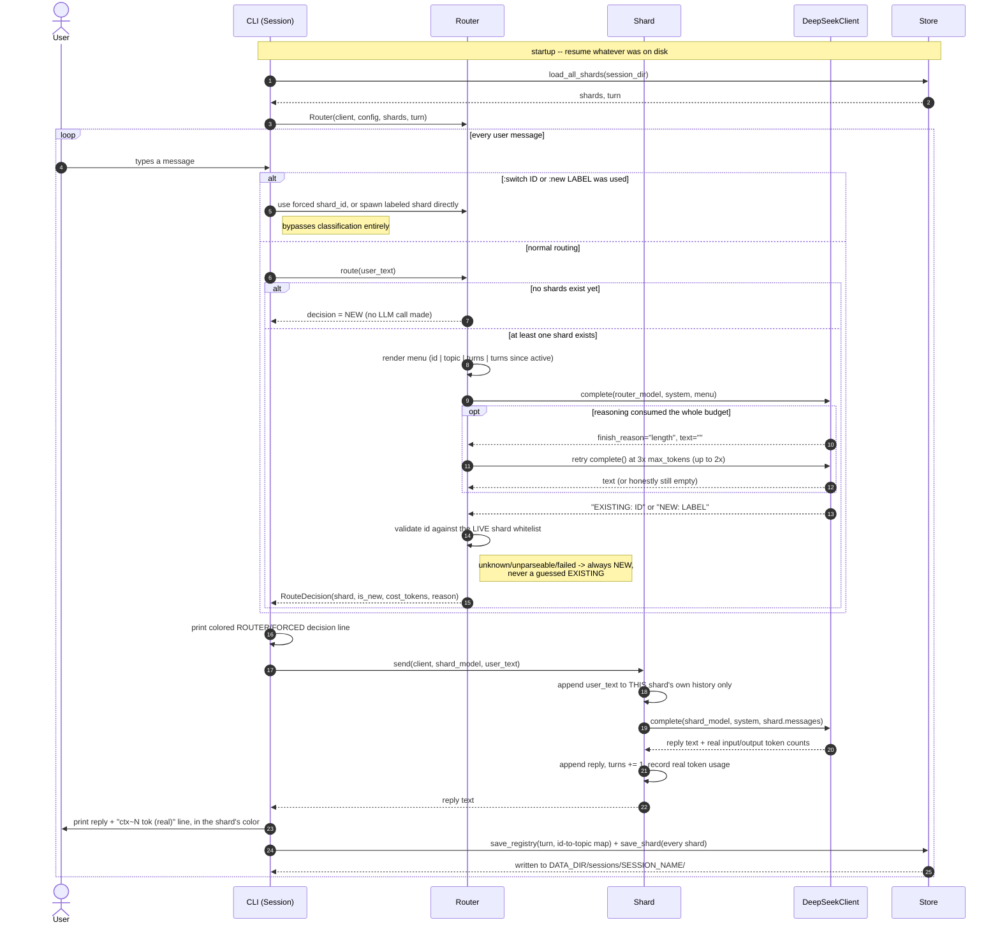

# Architecture

See `docs/design/orchestration-idea.md` for *why* this exists. This document
is about *how* the pieces here actually work.

## Glossary

Every term below is used somewhere in this document (and in the code) —
this is a reference to check against as you read the rest, not something
you need to memorize up front.

**The core idea, in three terms**

- **Shard** — one isolated, topic-specific conversation. A `Shard` (the
  Python class in `hydra/shard.py`) is the unit of context isolation this
  whole project exists to create: it has its own message history, its own
  system prompt, and never sees any other shard's messages. "Shard" and
  "thread" are used interchangeably in this project's prose (the CLI prints
  "thread" for readability; the code says `Shard`) — they mean the same
  object.
- **Router** — the thing that decides, for each incoming message, which
  shard it belongs to (or whether a new one is needed). Implemented by the
  `Router` class in `hydra/router.py`. It never talks to a shard's
  conversation directly — it only ever returns a decision.
- **Topic / topic label** — the short, human-readable name for what a shard
  is about (e.g. `"England weather"`, `"python code review"`). Chosen by the
  router's own model call when it decides a message needs a brand-new
  shard; stored as `Shard.topic_label`.

**Objects and their fields**

- **`Config`** (`hydra/config.py`) — every tunable in one place:
  `router_model`/`shard_model` (which LLM handles which kind of call),
  `router_max_tokens`/`shard_max_tokens` (completion budgets — see
  "reasoning model" below for why sizing this one needs care),
  `data_dir`/`session_name` (where persisted state lives).
- **`ChatResult`** (`hydra/llm.py`) — what every LLM call returns, regardless
  of provider: `.text` (the visible reply), `.input_tokens`/`.output_tokens`
  (the REAL usage the API reported — never an estimate), and
  `.finish_reason` (why the model stopped generating; see below).
- **`DeepSeekClient`** (`hydra/llm.py`) — the one class in this project that
  makes a network call. Wraps DeepSeek's OpenAI-compatible API and
  translates its response into a `ChatResult`, so nothing else in the
  codebase needs to know DeepSeek-specific or OpenAI-specific field names.
  `.complete(model, system, messages, max_tokens)` is its one method.
- **`Shard`** (`hydra/shard.py`) fields: `shard_id` (e.g. `"t1"`, `"t2"` —
  the unique handle used everywhere to refer to this shard), `topic_label`,
  `system_prompt` (the fixed instruction text prepended to every call for
  this shard), `messages` (this shard's own, private conversation history —
  a list of `{"role", "content"}` dicts), `turns` (how many
  message-then-reply exchanges this shard has had), `created_turn` (the
  *global* turn counter's value when this shard was spawned — see "turn"
  below), `last_input_tokens`/`last_output_tokens` (the real token counts
  from this shard's most recent call — this is what the CLI's
  `ctx~N tok (real)` line shows), `created_at`/`last_active_at` (wall-clock
  timestamps).
- **`Router`** (`hydra/router.py`) fields: `shards` (a dict of
  `shard_id -> Shard` — every shard this router currently knows about,
  loaded from disk at startup), `turn` (the *global* turn counter, shared
  across all shards — distinct from any single `Shard.turns`, which only
  counts that one shard's own exchanges).
- **`RouteDecision`** (`hydra/router.py`) — what `Router.classify()`/
  `Router.route()` return: `is_new` (bool), `shard_id` (set when routing to
  an existing shard), `topic_label` (set when a new one is needed),
  `cost_tokens` (how many tokens the *router's own* classification call
  cost — separate from, and much smaller than, the shard's own reply cost),
  `reason` (a human-readable string explaining the decision — this is what
  ends up mentioning things like "router: continues thread t3" or "router
  call failed").
- **`Session`** (`hydra/cli.py`) — the CLI's one stateful object: owns a
  `Router` plus everything needed to persist it (`Session.persist()`) after
  every turn. Not to be confused with a "session" on disk (below).

**Turn, session, and where things live**

- **Turn** — one full user-message-then-reply cycle. Tracked at two levels
  that are easy to conflate: `Router.turn` is the *global* counter
  (incremented once per message, regardless of which shard handled it) and
  is what `Shard.created_turn` records a snapshot of; `Shard.turns` is a
  *per-shard* counter (how many times *this* shard specifically has been
  used). The `:status` table's "turns" column is the per-shard count; its
  "created turn" column is the global counter's value at spawn time.
- **Session** (on disk) — a named, persisted collection of shards plus the
  global turn counter, identified by `--session NAME` (default `"default"`).
  Reusing a session name resumes exactly where that session left off.
- **`session_dir`** — the folder holding one session's on-disk state:
  `<data_dir>/sessions/<session_name>/`, containing `registry.json` (the
  turn counter plus a `shard_id -> topic_label` map) and one
  `shards/<shard_id>.json` per shard (a full `Shard.to_dict()` — its entire
  message history and bookkeeping).

**Routing mechanics**

- **`classify()`** — the router's *read-only* decision step: given the
  newest message, decide which shard it belongs to, without creating
  anything or mutating any state yet.
- **`route()`** — `classify()` plus committing to that decision: creates a
  new `Shard` if the classification said so, and advances the global `turn`
  counter.
- **Menu** — the short, plain-text summary of every existing shard (id,
  topic, turn count, turns since it was last used) that gets shown to the
  router's model alongside the newest message — this, not the shards'
  actual conversation content, is all the router ever sees.
- **`EXISTING` / `NEW`** — the only two verdicts the router's model is
  allowed to reply with: `EXISTING: <id>` (continue a named shard) or
  `NEW: <topic label>` (start a fresh one).
- **Whitelist validation / "never guess"** — the rule that an `EXISTING`
  verdict is only honored if the id it names is a real, currently-known
  shard; anything else (an id that doesn't exist, unparseable text, an
  empty reply, a raised exception) is treated as `NEW` instead of trusted.
- **Fallback (to NEW)** — the single safety net every failure mode routes
  through. See "The one deliberate asymmetry" in the section below for why
  it's always NEW and never a guessed `EXISTING`.
- **Forced routing** — bypassing `classify()`/`route()` entirely for one
  message via the CLI's `:switch <id>` or `:new <label>` commands.

**Reasoning-model terms (came up debugging a real failure)**

- **Reasoning model** — an LLM (like `deepseek-flash`) that generates a
  hidden internal chain-of-thought *before* writing its visible answer,
  both of which are paid for out of the same completion-token budget.
- **`reasoning_content` / `reasoning_tokens`** — DeepSeek's API exposes the
  hidden chain-of-thought as a separate field from the visible answer
  (`reasoning_content`), and reports its length separately
  (`reasoning_tokens`) from the visible text's length. `hydra/llm.py`
  currently reads only the visible answer.
- **`finish_reason`** — the API's field for why a generation stopped:
  `"stop"` means it finished naturally; `"length"` means it hit the
  `max_tokens` cap before finishing — which, for a reasoning model, can mean
  the hidden reasoning alone ate the entire budget, leaving nothing for the
  visible answer.
- **`max_tokens`** — the *total* completion budget for one call: hidden
  reasoning tokens and visible-answer tokens are drawn from the same pool,
  not separate ones.
- **Truncated-empty** — the specific failure signature this project had to
  detect and handle: `finish_reason == "length"` *and* an empty visible
  `.text`. This is unambiguous evidence that reasoning consumed the whole
  budget, as opposed to a short-but-real answer that merely got cut off.
- **Retry-on-truncation** — the fix: when a call comes back truncated-empty,
  `DeepSeekClient.complete()` automatically retries with 3x the budget (up
  to `max_retries` times) before giving up and returning the honest empty
  result.

**CLI terms**

- **REPL** — Read-Eval-Print Loop; the interactive `hydra chat` session
  that reads one message, acts on it, prints the result, and loops.
- **`:status`** — prints a table of every shard's stats (see "extended
  status" below).
- **Verbose** — an opt-in mode (`--verbose`/`-v` at startup, or `:verbose`
  to toggle mid-session) that auto-prints the extended status table after
  *every* turn, not just when `:status` is typed. `Session.verbose` (a
  plain bool) is the only state this adds.
- **Extended status** — the richer version of the status table (used by
  `:status` always, and by any turn while verbose is on): beyond the
  compact per-turn line, it adds each shard's last real *output*-token
  count (input is already shown as "ctx tok") and its "turns since
  active" — how many global turns have passed since that shard was last
  used, the exact figure the router's own menu shows the model when
  deciding where to route the next message (see "menu" above).
- **`ctx~N tok (real)`** — the line printed after every reply, showing that
  shard's actual last-call token count as reported by the API (the `~` is a
  leftover convention from an earlier rough-estimate version; the number
  itself is always the real count returned in the `ChatResult`, never
  estimated).
- **Color palette** — a fixed list of colors the CLI assigns to shards
  deterministically (by sorted shard-id position), so the same shard always
  renders in the same color for the life of a session.

## Modules

```
hydra/
  config.py    Config: model names, data dir/session name, token budgets
  llm.py       ChatResult + DeepSeekClient: the only network boundary
  shard.py     Shard: one isolated topic conversation
  store.py     JSON persistence for shards + the session registry
  router.py    Router: decides which shard a message goes to
  cli.py       the interactive REPL (colored output via `rich`)
```

Nothing here imports or depends on any other codebase. `llm.py` is the only
module that talks to a network API; every other module is plain Python data
structures and pure logic, which is what makes `router.py`/`shard.py`/
`store.py` fully unit-testable against `tests/fakes.py`'s `FakeLLMClient`
with zero network calls.

## How a turn flows (sequence diagram)



The one property every arrow above is protecting: a `Shard` only ever sees
messages appended to *itself* (step "append user_text to THIS shard's own
history only"). No arrow anywhere carries one shard's messages into another
shard's `complete()` call — that separation is the entire mechanism this
project is testing.

## The router's decision loop

For every message, `Router.classify()`:

1. If there are no shards yet, decide NEW immediately — no call is made,
   since there is nothing yet to route to.
2. Otherwise, render a short menu: each existing shard's id, topic label,
   turn count, and turns-since-last-active, plus the newest user message.
3. Make one call asking for exactly one line: `EXISTING: <id>` or
   `NEW: <topic label>`.
4. Parse the reply with a regex, then validate:
   - `EXISTING: <id>` is only honored if `<id>` is a real, currently known
     shard id.
   - Anything else (an unknown id, unparseable text, an empty reply, an
     exception raised by the call itself) becomes NEW.

**The one deliberate asymmetry, worth internalizing before changing this
file**: every failure mode falls back to NEW, never to a guessed EXISTING.
Spawning an unneeded shard is a cheap, visible, always-recoverable mistake —
worst case, two shards end up covering one topic, which `:status` makes
obvious. Trusting a wrong `EXISTING` id would silently splice a message into
a different topic's history, corrupting that shard in a way nothing
surfaces until much later, if ever. When in doubt, split, never merge.

## A real bug this surfaced, and the fix (in two stages)

`deepseek-flash` is a *reasoning* model: it spends completion tokens on
hidden reasoning before writing anything visible. The router's reply is
meant to be one short line, so the first version of this project gave it a
small `max_tokens` budget (60). In manual testing this produced an **empty
visible reply** (`finish_reason: "length"`) some fraction of the time — the
model's hidden reasoning alone consumed the entire budget, leaving zero
tokens for the actual verdict.

Because the router's fallback discipline treats an unparseable reply as
NEW, this didn't cause a wrong routing decision (misrouting into a wrong
existing shard was never fired) — but it did cause seemingly-*correct*
"return to an earlier topic" messages to spawn needless brand-new shards
instead, which is exactly the sticky-routing behavior this whole project is
about.

**Stage 1 (insufficient on its own): raise the constant.** `router_max_tokens`
was raised from 60 to 400. This helped, but a live debugging session over a
genuinely ambiguous real message ("do you have access to weather now?",
with both a weather thread and a tool-capability thread open) showed the
SAME prompt, called repeatedly, produces wildly different reasoning
lengths — measured directly:

```
attempt  finish_reason  reasoning_tokens
0        length         400   (hit the cap, empty visible text)
1        length         400   (hit the cap, empty visible text)
2        stop           225   (succeeded, well under the cap)
3        stop           279   (succeeded, well under the cap)
4        length         400   (hit the cap, empty visible text)
5        stop           130   (succeeded, comfortably under the cap)
```

Half of six identical calls still failed at `max_tokens=400`. **No single
fixed budget is safe for a reasoning model on an ambiguous decision** —
reasoning length is unbounded on the high end, so raising the constant only
lowers the failure rate, it never removes it.

**Stage 2 (the actual fix): retry on the specific truncated-empty signature.**
`DeepSeekClient.complete()` (`hydra/llm.py`) now detects exactly the
unambiguous failure case — `finish_reason == "length"` AND empty text (never
a short-but-legitimate answer, which has real content even if technically
truncated) — and retries with **3x the budget**, up to `max_retries` (default
2) extra attempts, before giving up and returning the honest empty result
for the caller's existing fallback logic to handle. Re-running the same
ambiguous case above 8 times after this fix: **0/8 truncated**, vs. 3/6
before. See `tests/test_llm.py` for the retry-logic tests (clean answer
needs no retry; truncated-empty retries and succeeds; a short answer that
merely hit the length cap with real content is NOT retried; retries are
capped and the last empty result is still returned honestly if every
attempt fails) and `hydra/llm.py`'s `complete()` docstring.

**Lesson for anyone touching this further**: for a reasoning-capable model,
detect-and-retry on the specific "reasoning consumed the whole budget"
signature, not just a bigger static `max_tokens` guess.

## Persistence

A session lives under `<data_dir>/sessions/<session_name>/`:

```
registry.json          {"turn": N, "shards": {shard_id: topic_label}}
shards/<shard_id>.json  Shard.to_dict() -- full message history + bookkeeping
```

Loading a session is just reading these back into `Shard`/`Router` objects;
there's no separate "replay" step, because a shard's message list already
*is* its full state. `Session.persist()` (`cli.py`) rewrites both the
registry and every shard's file after each turn — simple and correct for a
single-user CLI prototype, though it means a session shared across multiple
concurrent processes would race (out of scope here).

## CLI

`Session` (`cli.py`) owns the `Router` plus persistence and is the only
stateful object the CLI touches directly. Colors are assigned per shard id
deterministically (sorted-id position into a fixed palette), so the same
shard always renders in the same color for the life of a session.

`print_status(console, extended=False)` renders a `rich.table.Table` of
every shard. The compact form (`extended=False`) shows id, topic, turn
count, and last real context-token count. `:status` always asks for the
extended form; `Session.verbose` (set at startup with `--verbose`/`-v`, or
flipped mid-session with `:verbose`) makes `handle_message()` print that
same extended table automatically after every turn, adding two columns the
compact form skips: each shard's last real *output*-token count, and how
many global turns it's been since that shard was last active — computed the
same way `router._render_menu()` computes it for the model's own routing
menu, just surfaced to the terminal instead of only ever feeding a prompt.

`:switch <id>` and `:new <label>` bypass the router entirely for one
message — useful for testing/debugging a specific shard, or for manually
correcting a misroute, without needing a code change.
